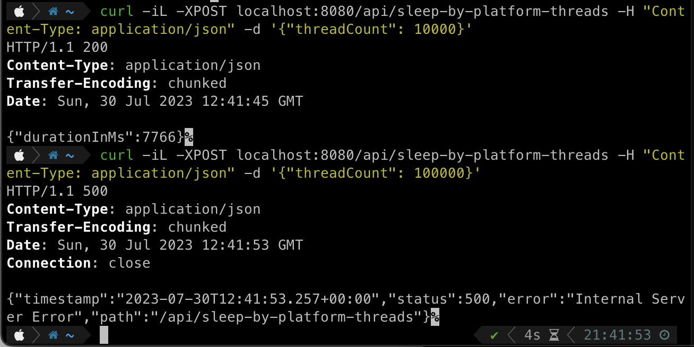
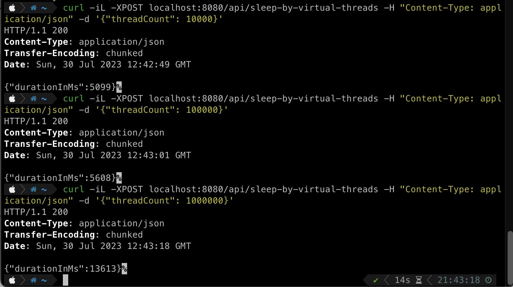
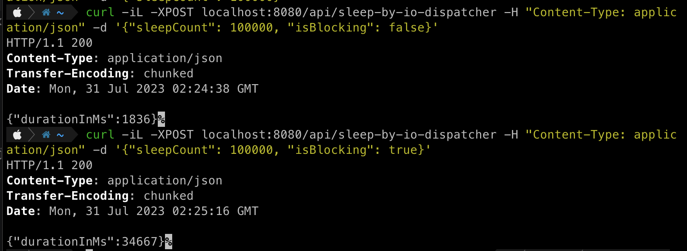
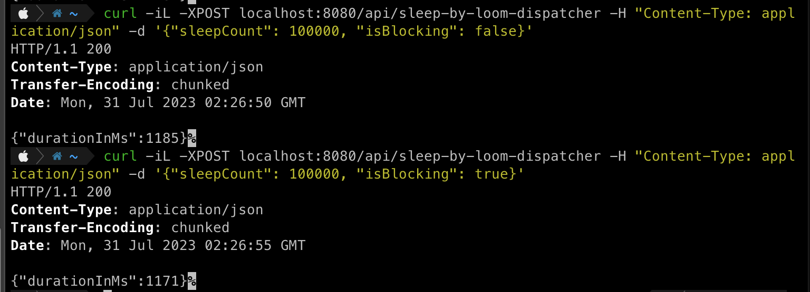

# Project Loom Kotlin Demo

Starting from JVM 19, the virtual threads of Project Loom are provided as a preview feature.
This demo provides test API endpoints for comparing virtual threads with platform threads and Kotlin coroutines.

# Usage

```bash
curl -iL -XPOST localhost:8080/api/sleep-by-platform-threads -H "Content-Type: application/json" -d '{"threadCount": 100000}'
curl -iL -XPOST localhost:8080/api/sleep-by-virtual-threads -H "Content-Type: application/json" -d '{"threadCount": 100000}'
curl -iL -XPOST localhost:8080/api/sleep-by-io-dispatcher -H "Content-Type: application/json" -d '{"sleepCount": 100000, "isBlocking": true}'
curl -iL -XPOST localhost:8080/api/sleep-by-loom-dispatcher -H "Content-Type: application/json" -d '{"sleepCount": 100000, "isBlocking": true}'
```

# Results

|  | 
|:--:| 
| *Platform Threads* |

|  | 
|:--:| 
| *Virtual Threads* |

|  | 
|:--:| 
| *Dispatchers.IO* |

|  | 
|:--:| 
| *Virtual Thread per Task Dispatcher* |

# References

- [Coroutines and Loom behind the scenes by Roman Elizarov](https://www.youtube.com/watch?v=zluKcazgkV4)
- [Running Kotlin coroutines on Project Loom's virtual threads](https://kt.academy/article/dispatcher-loom)
